# ASAN、valgrind（内存泄露的检测工具）

## 一、工具概览

### ASan

#### 什么是 AddressSanitizer？

[AddressSanitizer](https://github.com/google/sanitizers/wiki/AddressSanitizer)（又名 ASan）是一款适用于 C/C++ 的内存错误检测器。

#### 主要检测什么问题？

ASan可以检测出程序中不合理的内存使用行为，主要包括以下行为：

| **错误行为**              | **简介**                                                     |
| ------------------------- | ------------------------------------------------------------ |
| global buffer overflow    | 全局内存访问越界                                             |
| heap buffer overflow      | 堆内存访问越界[github.com](https://github.com/google/sanitizers/wiki/AddressSanitizerExampleHeapOutOfBounds) |
| initialization order bugs | 全局变量初始化顺序异常全局变量初始化间存在依赖，导致实际运行时因初始化顺序问题导致的初始值异常 |
| memory leaks              | 内存泄漏在程序正常退出时输出报告                             |
| stack buffer overflow     | 栈内存访问越界                                               |
| use after free            | 访问已经释放的内存，在释放内存后仍然尝试访问此内存[AddressSanitizerExampleUseAfterFree · google/sanitizers Wiki](https://github.com/google/sanitizers/wiki/AddressSanitizerExampleUseAfterFree) |
| use after return          | 访问生命周期结束的对象在函数退出后尝试访问函数内声明的局部变量 |
| user after scope          | 访问生命周期结束的对象在"{}"包起来的代码块外访问代码块内声明的局部变量 |

### Valgrind

#### 什么是 Valgrind（重点是 Memcheck）？

Valgrind 是一个用于构建动态分析工具的插桩框架。Valgrind 中的一些工具可以自动检测许多内存管理和线程错误，并详细分析您的程序。还可以使用 Valgrind 构建新的工具。

Valgrind 发行版目前包含七个生产级工具：一个内存错误检测器、两个线程错误检测器、一个缓存和分支预测分析器、一个调用图生成缓存和分支预测分析器，以及两个不同的堆分析器。其中最受欢迎的工具是 Memcheck。它可以检测 C 和 C++ 程序中常见的许多内存相关错误，这些错误可能导致程序崩溃和不可预测的行为。

#### 主要检测什么问题？

检测内存泄露，数组越界等一些程序中常见的错误。特别的，它的 memcheck 工具能够检测内存泄漏、未初始化内存的使用和非法的内存访问。

## 二、原理机制

### ASan工作机制

- 在编译时，ASan会替换malloc/free接口
- 在程序申请内存时，ASan会额外分配一部分内存来标识该内存的状态
- 在程序使用内存时，ASan会额外进行判断，确认该内存是否可以被访问，并在访问异常时输出错误信息
- 详细的工作原理官方文档：https://github.com/google/sanitizers/wiki/AddressSanitizerAlgorithm

### Valgrind工作机制

#### 工作原理

Valgrind由内核（core）以及基于内核的其他调试工具组成。内核类似于一个框架（framework），它模拟了一个CPU环境，并提供服务给其他工具；而其他工具则类似于插件 (plug-in)，利用内核提供的服务完成各种特定的内存调试任务。最直观的表达就是：`Valgrind内核 + 工具插件 = Valgrind工具`。在Valgrind框架下编写一个二进制程序动态分析工具比从零开始简很多，因为Valgrind内核为新工具的编写提供了许多通用的工具集，比如错误记录、动态插桩等。

当Valgrind工具程序启动时：

1. 将需要分析的程序加载与工具程序同一个进程空间中；
2. 使用`JIT（just-in-time）`的动态二进制重编译技术，将代码分成一个个小的代码块实施重编译；
3. 在重编译过程中，**Valgrind内核会将相应代码块的机器码转化成中间表示**，插件会在中间代码中进行相应分析代码的**插桩**，最后通过内核把中间表示转换成原本的机器码，在目标机器上执行；**（源机器码 --> 插桩 --> 目标机器码）**
4. Valgrind内核大部分时间花在上述机器码和中间表示的相互翻译执行中，**而原程序的所有机器码并没有执行，执行的都是插桩后的代码**

所有的Valgrind工具都是使用**静态链接**的可执行文件，里面包含了Valgrind内核和工具插件。虽然这样会导致每个工具程序中都需要包含一份Valgrind内核，内核大概2.5MB左右，稍微浪费一些磁盘空间，但是静态链接可以使整个可执行文件加载到非标准的启动地址，方便把待分析程序加载进同一个进程空间中，然后使用Valgrind重编译技术将待分析程序机器码重编译到别的地址执行。

##### 核心框架

Valgrind的体系结构如下图所示：


##### 工具启动

```mermaid
graph TD
    A[命令行运行 valgrind --tool=&lt;tool&gt;] --> B[valgrind 程序根据 tool 参数调用 execv]
    B --> C[加载对应的 Valgrind 工具插件]
    C --> D[Valgrind 内核初始化子系统<br>（地址空间管理器、内存分配器等）]
    D --> E[映射目标程序的 .text/.data 段<br>配置堆栈等]
    E --> F[初始化命令行参数<br>并加载工具插件]
    F --> G[加载更多子系统：<br>翻译表、信号处理、调度器、调试信息等]
    G --> H[准备完毕，开始执行目标程序第一条指令<br>进行 JIT 重编译（插桩）并运行]
```



##### 中间表示（VEX）

在Valgrind的重编译的过程中，使用的中间表示是一种平台无关的语言——VEX，通过屏蔽硬件平台的差异性，节省了大量针对不同平台的插桩代码。

- Statement（结构体`IRStmt`）表示有副作用的操作，如写寄存器、写内存、临时变量赋值等。其中，Statement由Expression组成。

- Expression (结构体`IRExpr`) 表示没有副作用的操作，如读内存、做算术运算等，这些操作可以包含子表达式和表达式树。

- 在Valgrind中，代码被分解成多个小的代码块，每个代码块里包含VEX的Statement列表。每个代码块的结构体是`IRSB`，`IRSB`是单入口多出口的，代码如下所示：

  ```c++
  typedef
     struct {
        IRTypeEnv* tyenv; // 表明IRSB中每个临时变量的类型
        IRStmt**   stmts; // VEX语句列表
        Int        stmts_size; // Statements总长度
        Int        stmts_used; // 实际上使用的Statements的数目
        IRExpr*    next; // 下一跳的位置
        IRJumpKind jumpkind; // 最后代码块结束jump的类型
        Int        offsIP; // IP寄存器的偏移
     }
     IRSB;
  ```

- Valgrind根据一定规则将代码划分为很多小代码块后，会进行以下八个阶段，将插件的分析代码进行插桩并优化：

  ```mermaid
  graph TD
      A[反汇编：机器码] --> B[树状中间表示]
      B --> C[扁平中间表示]
      C --> D[带桩的扁平中间表示]:::important
      D --> E[优化的扁平中间表示]
      E --> F[汇编：带桩的树状中间表示]:::important
      F --> G[目标汇编代码]
      G --> H[寄存器优化的目标汇编代码]
      H --> I[机器码]
   classDef important fill:#fff3e0,stroke:#ff9800,stroke-width:2px;
  ```

- JIT执行：

  ```mermaid
  flowchart TD
      A[插桩后的机器码生成] --> B[保存到固定大小的哈希表<br>（线性探测，80%阈值）]:::important
      B --> C{哈希表是否达到80%容量？}
      C -- 是 --> D[FIFO策略<br>丢弃1/8最旧的代码块]
      C -- 否 --> E[继续执行]
      E --> F[代码块执行完毕]
      D --> F
      F --> G[进入dispatcher（汇编实现）]
      G --> H{dispatcher快速缓存命中？}
      H -- 是 --> I[切换到下一个代码块（快速跳转）]
      H -- 否 --> J[进入scheduler（C实现）]
      J --> K{哈希表中存在目标代码块？}
      K -- 是 --> L[更新dispatcher缓存<br>并跳转]
      K -- 否 --> M[重新插桩编译<br>加入哈希表并更新dispatcher缓存]
      M --> L
   classDef important fill:#fff3e0,stroke:#ff9800,stroke-width:2px;
  ```

##### Memcheck 检测原理

**Memcheck**检测内存问题的原理如下图所示：


Memcheck 能够检测出内存问题，关键在于其建立了两个全局表。

- Valid-Value 表：对于进程的整个地址空间中的每一个字节(byte)，都有与之对应的 8 个 bits；对于 CPU 的每个寄存器，也有一个与之对应的 bit 向量。这些 bits 负责记录该字节或者寄存器值是否具有有效的、已初始化的值。
- Valid-Address 表：对于进程整个地址空间中的每一个字节(byte)，还有与之对应的 1 个 bit，负责记录该地址是否能够被读写。


**检测原理**：

- 当要读写内存中某个字节时，首先检查这个字节对应的 A bit。如果该A bit显示该位置是无效位置，memcheck 则报告读写错误。
- 内核（core）类似于一个虚拟的 CPU 环境，这样当内存中的某个字节被加载到真实的 CPU 中时，该字节对应的 V bit 也被加载到虚拟的 CPU 环境中。一旦寄存器中的值，被用来产生内存地址，或者该值能够影响程序输出，则 memcheck 会检查对应的V bits，如果该值尚未初始化，则会报告使用未初始化内存错误。

##### Valgrind回调Memcheck

```c++
static void mc_pre_clo_init( void );
static void mc_post_clo_init ( void );
IRSB* MC_(instrument) ( VgCallbackClosure* closure,
                        IRSB* sb_in,
                        const VexGuestLayout* layout,
                        const VexGuestExtents* vge,
                        const VexArchInfo* archinfo_host,
                        IRType gWordTy, IRType hWordTy );
static void mc_fini ( Int exitcode );
```

上述四个接口，由Valgrind在不同阶段调用。其中，`mc_pre_clo_init` 和 `mc_post_clo_init`用于初始化memcheck插件，`MC_(instrument)` 是在scheduler需要translate的插桩阶段会调用。

```c++
   VG_(track_new_mem_startup)     ( mc_new_mem_startup );
   VG_(track_new_mem_mmap)        ( mc_new_mem_mmap );
   VG_(track_change_mem_mprotect) ( mc_new_mem_mprotect );
   VG_(track_copy_mem_remap)      ( MC_(copy_address_range_state) );
   VG_(track_die_mem_stack_signal)( MC_(make_mem_noaccess) );
   VG_(track_die_mem_brk)         ( MC_(make_mem_noaccess) );
   VG_(track_die_mem_munmap)      ( MC_(make_mem_noaccess) );
...
   VG_(track_die_mem_stack)       ( mc_die_mem_stack     );
   VG_(track_ban_mem_stack)       ( MC_(make_mem_noaccess) );
   VG_(track_pre_mem_read)        ( check_mem_is_defined );
   VG_(track_pre_mem_read_asciiz) ( check_mem_is_defined_asciiz );
   VG_(track_pre_mem_write)       ( check_mem_is_addressable );
   VG_(track_post_mem_write)      ( mc_post_mem_write );
   VG_(track_post_reg_write)                  ( mc_post_reg_write );
   VG_(track_post_reg_write_clientcall_return)( mc_post_reg_write_clientcall );
```

上述这些 `VG_(track_*)` 函数是用于向Valgrind内核注册相应的事件监控，这些事件难以通过插桩来拦截的，如堆块的分配、堆栈指针的修改、信号处理等。当注册的事件发生时，Valgrind内核会调用Memcheck注册的函数。

#### 工具包

##### Memcheck※

Memcheck检测内存管理问题，主要针对C和C++程序。当一个程序在Memcheck的监督下运行时，所有对内存的读取和写入都会被检查，并拦截对malloc/new/free/delete的调用。因此，Memcheck可以检测您的程序是否：

- 访问不应该访问的内存（尚未分配的区域、已释放的区域、超过堆块末尾的区域、堆栈中不可访问的区域）。
- 以危险的方式使用未初始化的值。
- 内存泄漏。
- 对堆块执行错误的释放（双重释放、不匹配的释放）。
- 将重叠的源内存块和目标内存块传递给memcpy()和相关函数。

Memcheck会在这些错误发生时立即报告，给出发生错误的源行号，以及为到达该行而调用的函数的堆栈跟踪。Memcheck在字节级别跟踪可寻址性，在位级别跟踪值的初始化。因此，它可以检测单个未初始化位的使用，并且不会报告位字段操作中的虚假错误。Memcheck运行的程序比正常速度慢10-30倍。

##### Cachegrind

Cachegrind是一个缓存探查器。它对CPU中的I1、D1和L2缓存执行详细的模拟，因此可以准确地确定代码中缓存未命中的来源。它通过每个函数、每个模块和整个程序摘要来识别每行源代码的缓存未命中、内存引用和执行的指令的数量。它适用于用任何语言编写的程序。Cachegrind运行的程序比正常速度慢20-100倍。

##### Callgrind

Josef Weidendorfer的Callgrind是对Cachegrind的扩展。它提供了Cachegrind所做的所有信息，以及关于调用图的额外信息。它在3.2.0版本中被集成到Valgrind的主版本中。单独提供的是一个令人惊叹的可视化工具[KCachegrind](https://kcachegrind.sourceforge.net/html/Home.html)，它可以更好地概述Callgrind收集的数据；它还可以用于可视化Cachegrind的输出。

##### Massif

Massif是一个堆探查器。它通过获取程序堆的定期快照来执行详细的堆评测。它生成一个图表，显示堆使用情况随时间的变化，包括程序中哪些部分负责最多内存分配的信息。该图由一个文本或HTML文件补充，该文件包括更多信息，用于确定在哪里分配了最多的内存。Massif运行程序的速度比正常速度慢20倍。

##### Helgrind

Helgrind是一个线程调试器，用于在多线程程序中查找数据竞赛。它查找由多个（POSIX p-）线程访问的内存位置，但找不到一致使用的（pthread_mutex_）锁。这样的位置指示线程之间缺少同步，并且可能导致难以找到与定时相关的问题。它对任何使用pthreads的程序都很有用。这是一个有点实验性的工具，所以这里特别欢迎您的反馈。

##### DRD

DRD是一种用于检测多线程C和C++程序中错误的工具。该工具适用于任何使用POSIX线程原语或使用在POSIX线程基元之上构建的线程概念的程序。虽然Helgrind可以检测到违反锁定顺序的情况，但对于大多数程序来说，DRD执行其分析所需的内存较少。

##### Lackey，Nulgrind

Lackey和Nulgrind也包括在Valgrind分布中。它们做的不多，只是为了测试和演示。

##### DHAT

DHAT是一个用于检查程序如何使用堆分配的工具。它跟踪分配的块，并检查每次内存访问，以找到要访问的块（如果有的话）。它还附带了一个GUI，以便于探索配置文件结果

#### 源码路径

| 步骤                      | 入口源码                                                   | 阅读重点                                                     |
| ------------------------- | ---------------------------------------------------------- | ------------------------------------------------------------ |
| 1️⃣ 启动流程                | `coregrind/m_main.c` 中的 `main()` 函数                    | Valgrind 启动逻辑、注册工具、加载用户程序                    |
| 2️⃣ 工具注册                | `memcheck/mc_main.c` 中的 `vg_module_local_pre_clo_init()` | Memcheck 是如何作为插件注册并接管分析任务的                  |
| 3️⃣ 插桩入口                | `memcheck/mc_translate.c` 中的 `mc_instrument()`           | 如何在 VEX IR 上插入 shadow memory 逻辑来检测读写            |
| 4️⃣ shadow memory 实现      | `memcheck/mc_machine.c`、`mc_memory.c`                     | 如何为用户空间内存建立 shadow 映射<br>如何检查是否初始化、是否重叠写入等 |
| 5️⃣ 报错逻辑                | `memcheck/mc_errors.c`                                     | 各类内存错误的触发条件、错误消息打印函数                     |
| 6️⃣ VEX IR 转换（了解即可） | `VEX/pub/libvex.h`、`coregrind/m_translate.c`              | 了解如何将指令翻译成 IR 并应用插件逻辑                       |

#### 源码分析


##### memcheck插桩

## 三、安装与使用方式

### ASan 使用

#### 安装Asan

在 Ubuntu 上，**ASan (AddressSanitizer)** **不需要单独安装**，因为它是 **GCC** 或 **Clang** 编译器自带的功能模块。你只需要确保你的 **GCC** 或 **Clang** 版本支持 ASan（一般 Ubuntu 18.04+ 默认都支持）。

#### 使用Asan

1. 使用要求：编译时加上 `-fsanitize=address -g`（`-fsanitize=address`：启用 AddressSanitizer，`-g`：生成调试符号，方便错误定位到具体源码行号）

   ```bash
   # eg
   g++ -fsanitize=address -g your_code.cpp -o your_program
   # -fno-omit-frame-pointer 让栈追溯信息更加友好
   ```

2. 编译后直接运行，出现非法内存访问、溢出、use-after-free 等时，ASan 会自动终止程序并输出详细错误栈信息。

   ```bash
   ./your_program
   ```

3. 进阶配置：可以通过环境变量控制 ASan 行为：

   - 显示更多详细信息：

     ```bash
     export ASAN_OPTIONS=verbosity=1
     ```

   - 打印出泄漏检测（需要加 `-fsanitize=leak`）：

     ```bash
     export ASAN_OPTIONS=detect_leaks=1
     ```

     ```bash
     # eg：
     export ASAN_OPTIONS=detect_leaks=1:abort_on_error=1
     ./your_program
     ```

     | **flag**                      | **含义**                                                     |
     | ----------------------------- | ------------------------------------------------------------ |
     | halt_on_error                 | 默认为1，ASan检测到错误后会中止程序设为0后，ASan检测到错误后不会中止程序 |
     | log_path                      | 设置错误信息的输出路径                                       |
     | detect_stack_use_after_return | 是否检测use after return错误默认为0，即关闭该检测功能        |
     | help=1                        | 输出所有支持的参数                                           |

- 编译加上 `-fsanitize=address -g`

  

更多ASAN_OPTIONS可以参考：https://github.com/google/sanitizers/wiki/AddressSanitizerFlags

### Valgrind 使用

#### 安装 Valgrind

```sh
sudo apt install valgrind 
```


#### 使用valgrind

1. 使用要求：编译程序时使用调试信息选项 -g（使用编译程序以-g包含调试信息，以便 Memcheck 的错误消息包含准确的行号。-O0如果您可以忍受速度变慢，使用也是一个好主意。 -O1错误消息中的行号可能不准确，但通常情况下，在编译的代码上运行 Memcheck-O1效果很好，而且与直接运行相比，速度提升-O0非常显著。 -O2不建议使用及以上版本，因为 Memcheck 偶尔会报告实际上并不存在未初始化值的错误）。
2. 使用方法：使用 valgrind 运行程序：valgrind --leak-check=full ./your_program
3. 常用选项：
   - --leak-check=full：启用详细的内存泄漏检测。
   - --track-origins=yes：在内存未初始化时，报告其来源。
   - --log-file=filename：将 Valgrind 的输出写入文件 filename

## 四、检测能力比较

| 比较项         | ASan                            | Valgrind                          |
| -------------- | ------------------------------- | --------------------------------- |
| 检测内存越界   | ✅ 高效准确                      | ✅ 高效准确                        |
| 检测内存泄漏   | ✅（可选配 LeakSanitizer）       | ✅（默认内置）                     |
| 检测未初始化读 | ❌（需要另加 MSan）              | ✅                                 |
| 检测堆栈溢出   | ✅（有限支持）                   | ✅（通过 Memcheck 支持）           |
| 检测速度       | 🔥 极快（通常 2x-3x 原程序速度） | 🐢 较慢（通常 10x-50x 原程序速度） |
| 支持大程序     | ✅ 支持大内存程序                | ❌ 容易内存爆掉                    |
| 平台支持       | Linux、macOS、Windows (部分)    | Linux、macOS（Windows 支持差）    |

## 五、输出示例与解读

### ASan 错误输出示例

#### 验证代码

```c++
int main(int argc, char **argv) {
  int *array = new int[100];
  delete [] array;
  return array[argc];  // BOOM
}
// RUN: clang -O -g -fsanitize=address %t && ./a.out
```

#### 验证结果

```c++
=================================================================
==6254== ERROR: AddressSanitizer: heap-use-after-free on address 0x603e0001fc64 at pc 0x417f6a bp 0x7fff626b3250 sp 0x7fff626b3248
READ of size 4 at 0x603e0001fc64 thread T0
    #0 0x417f69 in main example_UseAfterFree.cc:5
    #1 0x7fae62b5076c (/lib/x86_64-linux-gnu/libc.so.6+0x2176c)
    #2 0x417e54 (a.out+0x417e54)
0x603e0001fc64 is located 4 bytes inside of 400-byte region [0x603e0001fc60,0x603e0001fdf0)
freed by thread T0 here:
    #0 0x40d4d2 in operator delete[](void*) /home/kcc/llvm/projects/compiler-rt/lib/asan/asan_new_delete.cc:61
    #1 0x417f2e in main example_UseAfterFree.cc:4
previously allocated by thread T0 here:
    #0 0x40d312 in operator new[](unsigned long) /home/kcc/llvm/projects/compiler-rt/lib/asan/asan_new_delete.cc:46
    #1 0x417f1e in main example_UseAfterFree.cc:3
Shadow bytes around the buggy address:
  0x1c07c0003f30: fa fa fa fa fa fa fa fa fa fa fa fa fa fa fa fa
  0x1c07c0003f40: fa fa fa fa fa fa fa fa fa fa fa fa fa fa fa fa
  0x1c07c0003f50: fa fa fa fa fa fa fa fa fa fa fa fa fa fa fa fa
  0x1c07c0003f60: fa fa fa fa fa fa fa fa fa fa fa fa fa fa fa fa
  0x1c07c0003f70: fa fa fa fa fa fa fa fa fa fa fa fa fa fa fa fa
=>0x1c07c0003f80: fa fa fa fa fa fa fa fa fa fa fa fa[fd]fd fd fd
  0x1c07c0003f90: fd fd fd fd fd fd fd fd fd fd fd fd fd fd fd fd
  0x1c07c0003fa0: fd fd fd fd fd fd fd fd fd fd fd fd fd fd fd fd
  0x1c07c0003fb0: fd fd fd fd fd fd fd fd fd fd fd fd fd fd fa fa
  0x1c07c0003fc0: fa fa fa fa fa fa fa fa fa fa fa fa fa fa fa fa
  0x1c07c0003fd0: fa fa fa fa fa fa fa fa fa fa fa fa fa fa fa fa
Shadow byte legend (one shadow byte represents 8 application bytes):
  Addressable:           00
  Partially addressable: 01 02 03 04 05 06 07 
  Heap left redzone:     fa
  Heap righ redzone:     fb
  Freed Heap region:     fd
  Stack left redzone:    f1
  Stack mid redzone:     f2
  Stack right redzone:   f3
  Stack partial redzone: f4
  Stack after return:    f5
  Stack use after scope: f8
  Global redzone:        f9
  Global init order:     f6
  Poisoned by user:      f7
  ASan internal:         fe
==6254== ABORTING
```

#### 结果分析

```sh
1. 错误类型摘要
    # ASan 检测到错误类型是 heap-use-after-free，表示访问了已经释放的堆内存。
    ==6254== ERROR: AddressSanitizer: heap-use-after-free on address 0x603e0001fc64

2. 出错位置
    # 错误发生在 example_UseAfterFree.cc 文件的第5行 main 函数中。
    # 出错时正在读取（READ）4字节的数据。
    READ of size 4 at 0x603e0001fc64 thread T0
      #0 0x417f69 in main example_UseAfterFree.cc:5
      #1 0x7fae62b5076c (/lib/x86_64-linux-gnu/libc.so.6+0x2176c)
      #2 0x417e54 (a.out+0x417e54)

3. 内存分配与释放信息
    # 这块内存是在 example_UseAfterFree.cc 文件第3行通过 new[] 分配的。
    previously allocated by thread T0 here:
      #0 0x40d312 in operator new[](unsigned long)
      #1 0x417f1e in main example_UseAfterFree.cc:3

    # 这块内存已经在第4行通过 delete[] 被释放。
    freed by thread T0 here:
      #0 0x40d4d2 in operator delete[](void*)
      #1 0x417f2e in main example_UseAfterFree.cc:4

4. Shadow Memory 状态
    # 出错地址周围的 Shadow Memory 信息如下：
    Shadow bytes around the buggy address:
      0x1c07c0003f80: fa fa fa fa fa fa fa fa fa fa fa fa [fd]fd fd fd
    # 其中 fd 表示 "Freed Heap Region"，即已经释放的堆内存。
    # 说明正在访问一块已经释放的堆区域，因此发生了 heap-use-after-free 错误。

5. Shadow Byte Legend
    # Shadow Byte 各个标记含义：
    - 00: 正常可访问内存
    - fd: 已释放的堆内存（Freed Heap region）
    - fa: 堆红区（Heap redzone，用于保护越界）
```

更多例子在：https://github.com/google/sanitizers/wiki/addresssanitizer的introduction部分

### Valgrind 输出示例

#### 验证代码

```c++
#include <iostream>
void func(){
    int* p = new int(10); // 只申请不回收，leak
}
int main(){

    func();
    return 0;
}
// sh命令
g++ test.cpp -g
valgrind --leak-check=full ./a.out
```

#### 验证结果

```sh
[root:~/stutest]# valgrind --leak-check=full ./a.out 
==1536437== Memcheck, a memory error detector
==1536437== Copyright (C) 2002-2017, and GNU GPL'd, by Julian Seward et al.
==1536437== Using Valgrind-3.18.1 and LibVEX; rerun with -h for copyright info
==1536437== Command: ./a.out
==1536437== 
==1536437== 
==1536437== HEAP SUMMARY: # 堆摘要
==1536437==     in use at exit: 4 bytes in 1 blocks
==1536437==   total heap usage: 2 allocs, 1 frees, 72,708 bytes allocated
==1536437== 
==1536437== 4 bytes in 1 blocks are definitely lost in loss record 1 of 1
==1536437==    at 0x48657B8: operator new(unsigned long) (in /usr/libexec/valgrind/vgpreload_memcheck-arm64-linux.so)
==1536437==    by 0x1088E3: func() (test.cpp:4)
==1536437==    by 0x108907: main (test.cpp:9)
==1536437== 
==1536437== LEAK SUMMARY: # 泄露摘要
==1536437==    definitely lost: 4 bytes in 1 blocks
==1536437==    indirectly lost: 0 bytes in 0 blocks
==1536437==      possibly lost: 0 bytes in 0 blocks
==1536437==    still reachable: 0 bytes in 0 blocks
==1536437==         suppressed: 0 bytes in 0 blocks
==1536437== 
==1536437== For lists of detected and suppressed errors, rerun with: -s
==1536437== ERROR SUMMARY: 1 errors from 1 contexts (suppressed: 0 from 0)
```

#### 结果分析

```sh
1. 堆摘要：
	# 在程序结束时，有 4 字节的内存仍然在使用，这意味着有一块 4 字节的内存没有被释放。
    in use at exit: 4 bytes in 1 blocks
    # 程序总共进行了 2 次内存分配操作（allocs），但是只进行了 1 次内存释放操作（frees），总共分配了 72,708 字节的内存。
    total heap usage: 2 allocs, 1 frees, 72,708 bytes allocated
2. 泄漏摘要
	# Valgrind 确认有 4 字节内存泄漏，这次泄漏的详细信息如下：
	4 bytes in 1 blocks are definitely lost in loss record 1 of 1
	# 内存是在调用 operator new 时分配的，这通常表示你使用了 new 操作符分配了内存。
	at 0x486578B: operator new(unsigned long) (in /usr/libexec/valgrind/vgpreload_memcheck-arm64-linux.so)
	# func() 函数中进行了内存分配，这是导致内存泄漏的地方。
	by 0x1088E3: func() (test.cpp:4)
	# main 函数调用了 func()，导致了内存泄漏。
	by 0x108907: main (test.cpp:9)
3. 错误摘要
	# 总共检测到 1 个内存泄漏错误，且没有任何错误被抑制。
    ERROR SUMMARY: 1 errors from 1 contexts (suppressed: 0 from 0)
```

### 常见内存泄漏的场景

```c++
#include <iostream>
#include <cstring>

void memoryLeak1() {
    // 简单的内存泄漏，没有释放分配的内存
    int* leakyArray = new int[100];
    // 忘记释放 leakyArray
}

void memoryLeak2() {
    // 动态分配的内存覆盖了原先分配的内存，导致原内存泄漏
    char* leakyString = new char[25];
    strcpy(leakyString, "Initial allocation");
    
    // 重新分配，原内存未释放
    leakyString = new char[50];
    strcpy(leakyString, "Reallocation causes leak");

    delete[] leakyString; // 释放第二次分配的内存
}

void memoryLeak3() {
    // 部分内存泄漏，未释放结构体中的某些成员
    struct Node {
        int* value;
        Node* next;
    };

    Node* node = new Node;
    node->value = new int(10);
    node->next = nullptr;

    delete node; // 只释放了 node，没有释放 node->value
}

void memoryLeak4() {
    // 使用未初始化的指针
    int* uninitializedPtr;
    *uninitializedPtr = 42; // 未定义行为
}

int main() {
    memoryLeak1();
    memoryLeak2();
    memoryLeak3();
    memoryLeak4();

    std::cout << "Done testing memory leaks!" << std::endl;
    return 0;
}
```

## 六、常见问题与坑

### **ASan 常见问题**

- 与某些库冲突（如 glibc 的 hook）
- 需要匹配 libc 版本
- asan版本程序在Linux环境下运行时会额外申请20TB的虚拟内存
  - 需要确保/proc/sys/vm/overcommit_memory的值不为2
  - 这也可以作为检验ASan是否工作的标志
- asan工具不是万能的，必须要跑到有问题的代码才可以暴露出来

### **Valgrind 常见问题**

- 运行特别慢
- 不支持 AVX-512、SIMD 优化程序
- 对于一些静态分配或在堆栈上分配的数组的超出范围的读取或写入，Valgrind 可能无法检测到
- 在检测某些复杂的内存错误场景时，可能会出现误报或漏报的情况

## 七、实战应用场景建议

### 什么时候优先用 ASan？

- 开发阶段，快速找到内存错误
- 代码量很大的时候用Asan

### 什么时候优先用 Valgrind？

- 找难以发现的泄漏和未初始化读问题，做深入分析

## 八、总结

- 两者优缺点汇总
- 推荐搭配使用的方法（如开发中用 ASan，发布前用 Valgrind 细扫）

学习资料

- https://valgrind.org/
- https://hardcore.feishu.cn/docx/doxcnXfsINxeICDFXePBelN3p5f

