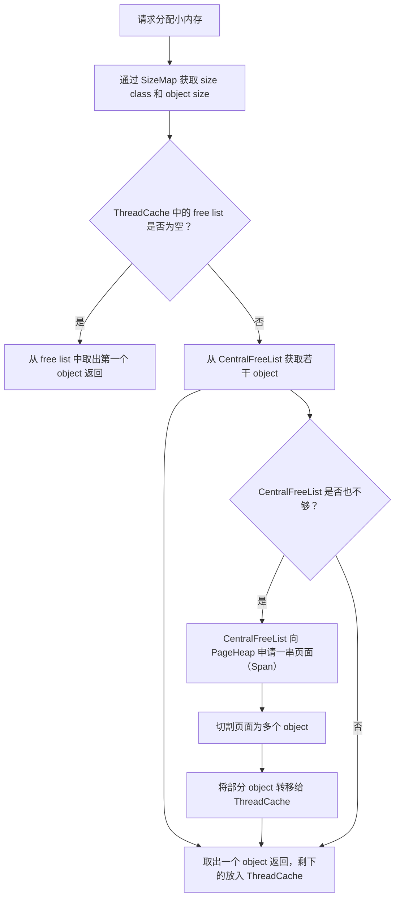
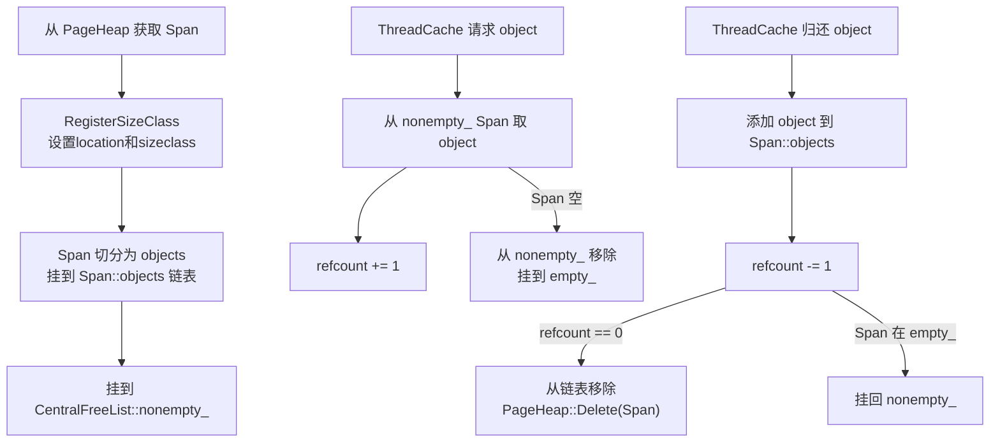
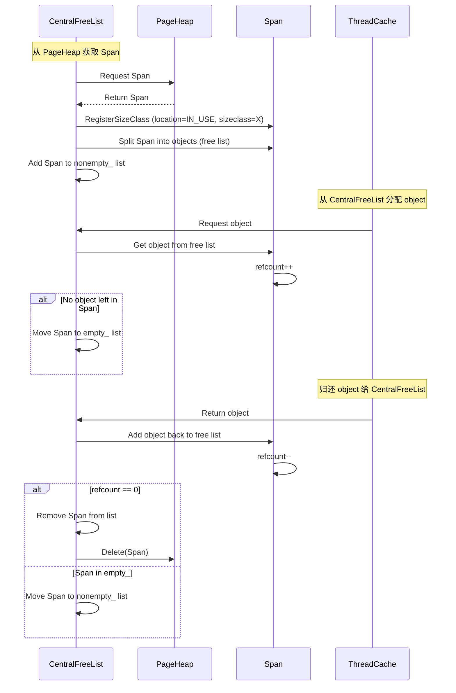
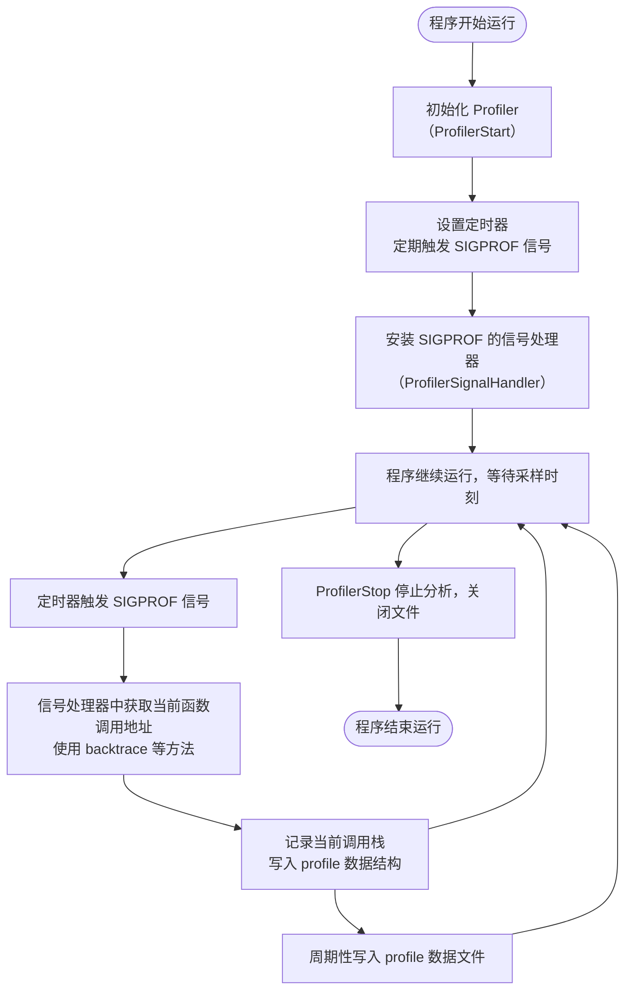
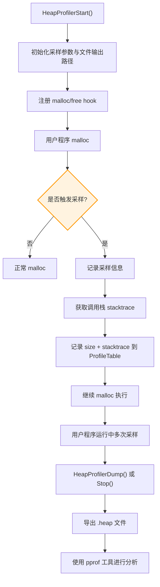

# gperftools（Google 提供的开源性能优化工具集）

## 一、工具概览

### 什么是 gperftools？

- gperftools 是 Google 提供的开源性能优化工具集，主要用于性能分析和内存管理。
- 包括 `tcmalloc`（高效的内存分配器）和 `cpu profiler`（CPU 性能分析器）。

### 主要功能

- **tcmalloc**：优化的内存分配器，替代标准的 `malloc`。
- **cpu profiler**：通过性能采样记录 **CPU 使用情况**，生成火焰图（flame graph）。
- **heap profiler**：分析程序的堆内存使用，检测内存泄漏和过度使用。

## 二、安装与配置

### **安装方式**

- 使用 `apt`（Ubuntu）：

  ```bash
  sudo apt-get install google-perftools libgoogle-perftools-dev
  ```

- 使用 `brew`（macOS）：

  ```bash
  brew install gperftools
  ```

- 编译源码：

  ```bash
  git clone https://github.com/gperftools/gperftools.git
  cd gperftools
  ./configure
  make
  sudo make install
  ```

### **配置环境**

- 环境变量设置：

  ```bash
  export LD_PRELOAD=/usr/local/lib/libtcmalloc.so
  ```

## 三、常用工具与命令

### 1. tcmalloc（内存分配器）

- 作用：提高内存分配与释放效率，减少内存碎片。
- 使用：
  - 在应用中通过设置 `LD_PRELOAD` 来加载 `libtcmalloc`。
  - 用 `gperftools` 编译的程序会自动使用 `tcmalloc`，无须修改代码。

### 2. CPU Profiler（CPU 性能分析）

#### 启用

- 编译时使用 `-lprofiler` 链接 profiler 库。

  ```bash
  # LD_PRELOAD 设置加载libprofiler.so
  # CPUPROFILE 设置采样文件
  # CPUPROFILE_FREQUENCY 设置采样频率，默认100
  # 强行结束不能获得采样文件 CPUPROFILESIGNAL设置采样开关信号，关闭采样只需要killall -12 perftest
  LD_PRELOAD=/usr/local/lib/libprofiler.so CPUPROFILE=data.prof CPUPROFILE_FREQUENCY=555 CPUPROFILESIGNAL=12 ./perftest --benchmark_min_time=10000x 
  ```

- 在代码中启动/停止 profiling：

  ```c++
  // 精确控制代码采样的区域
  #include <gperftools/profiler.h>
  ProfilerStart("data.prof");
  // 你的代码
  ProfilerStop();
  ```

#### 分析

- 使用 `pprof` 或`google-pprof`工具解析生成的 `data.prof` 文件：

  ```bash
  pprof --text ./your_program data.prof
  ```

  

  ```bash
  # 每一列含义分析，以红框为例
  # 函数中的样本数	函数中样本百分比	当前打印的样本百分比	函数以及其调用函数中的样本数量	函数以及其调用子函数中的样本百分比	函数名
  ```

- 还可以加入`--stackes`选项打印调用栈

  ```bash
  pprof --text --stacks ./your_program data.prof
  ```

  

- 发现这样不够直观，可以用`--svg`生成调用图更加直观

  ```bash
  pprof --svg ./your_program ./data.prof > svgout.svg
  ```

  

  ```bash
  # 结果分析
  # 第一行类名
  # 第二行函数名
  # 本函数执行执行的时间（直接执行的时间）
  # 本函数调用函数执行的时间（调用其他函数的时间）
  ```

- 可以生成火焰图：

  ```bash
  pprof --flame ./your_program data.prof
  ```

### 3. Heap Profiler（堆内存分析）

- 启用：

  - 编译时使用 `-lprofiler`。

  - 运行时启用 heap profiler：

    ```cpp
    #include <gperftools/heap-profiler.h>
    HeapProfilerStart("heap_profile");
    ```

- 分析：

  - 查看生成的 `heap_profile` 文件，定位内存泄漏、内存过度分配等问题。

### 4. Leak Detector（内存泄漏检测）

- 自动检测：当启用 `tcmalloc` 时，`gperftools` 自动跟踪内存分配，报告泄漏。

- 例子：

  ```bash
  export HEAPPROFILE=heap_profile
  ./your_program
  ```

### 5. 常用命令总结

```bash
# 第一个是用源码编译的，第二个是用apt下载的
pprof --help
google-pprof --help
```

| **Options**               | **功能 (NAME)**                          |
| ------------------------- | ---------------------------------------- |
| `--cum`                   | 按累计数据排序                           |
| `--base=<base>`           | 在显示前从配置文件中减去 `<base>`        |
| **Reporting Granularity** | **报告粒度**                             |
| `--addresses`             | 按地址级别报告                           |
| `--lines`                 | 按源代码行级别报告                       |
| `--functions`             | 按函数级别报告（默认）                   |
| `--files`                 | 按源代码文件级别报告                     |
| **Output Type**           | **输出类型**                             |
| `--text`                  | 生成文本报告（默认）                     |
| `--gv`                    | 生成 Postscript 并显示                   |
| `--list=<regexp>`         | 生成匹配常规表达式的源代码列表           |
| `--disasm=<regexp>`       | 生成匹配常规表达式的指令反汇编代码       |
| `--dot`                   | 生成 DOT 格式的文件并输出到标准输出      |
| `--ps`                    | 生成 Postscript 格式文件输出到标准输出   |
| `--pdf`                   | 生成 PDF 格式文件输出到标准输出          |
| `--gif`                   | 生成 GIF 格式文件输出到标准输出          |
| **Heap-Profile Options**  | **堆分析选项**                           |
| `--inuse_space`           | 显示当前使用的内存（以MB为单位，默认）   |
| `--inuse_objects`         | 显示当前使用的对象数量                   |
| `--alloc_space`           | 显示已分配的内存（以MB为单位）           |
| `--alloc_objects`         | 显示已分配的对象数量                     |
| `--show_bytes`            | 显示内存使用量（以字节为单位）           |
| `--drop_negative`         | 忽略负值差异                             |
| **Call-graph Options**    | **调用图选项**                           |
| `--nodecount=<n>`         | 显示最多 `<n>` 个节点（默认80）          |
| `--nodefraction=<f>`      | 隐藏占总数小于 `<f>` 的节点（默认0.005） |
| `--edgefraction=<f>`      | 隐藏占总数小于 `<f>` 的边（默认0.001）   |
| `--focus=<regexp>`        | 只聚焦匹配 `<regexp>` 的节点             |
| `--ignore=<regexp>`       | 忽略匹配 `<regexp>` 的节点               |
| `--scale=<n>`             | 设置 GV 渲染的缩放比例（默认0）          |

## 四、工具集成与调优

### **集成与调试**

- 配合 **perf** 或 **Valgrind** 使用，进行内存、CPU 性能多角度分析。
- 与 **gdb** 配合，调试性能问题和内存泄漏。

### **性能优化**

- 优化内存使用，减少内存分配开销。
- 通过 `CPU profiler` 定位 CPU 瓶颈函数，优化代码热点。
- 使用 `Heap Profiler` 分析程序内存消耗，减少不必要的内存分配。

## 五、工作原理与源码分析

### tcmalloc

#### 介绍

tcmalloc是google开发的一个专门为高并发场景优化的内存分配器，全称为”thread cache malloc”。按照[官网](http://goog-perftools.sourceforge.net/doc/tcmalloc.html)的介绍，tcmalloc相比于glibc2.3的malloc(底层实现为ptmalloc2)主要有以下优点：

1. 快速：一台2.8GHz的P4机器上，执行一次malloc及free大约需要300纳秒;而tcmalloc的版本同样的操作大约只需要50纳秒。
2. 空间占用小：相比ptmalloc2，tcmalloc对小对象占用空间进行了优化。例如：分配N个8字节对象只需要占用8N*1.01字节的空间。即，只需要多使用1%的空间。而ptmalloc2中每个对象都需要使用一个4字节的头信息，最后占用的字节可能达到8N*8。
3. 不容易出现内存暴涨

#### 替换原理

glibc中的memory-allocation方法均被为声明为[弱符号](https://en.wikipedia.org/wiki/Weak_symbol)，只需要在tcmalloc中将其重新定义即可。 具体的重新定义代码在src/libc_override*.h中(不同平台实现不同)，下面是Linux平台下部分memory-allocation函数的重新定义实现：

```c++
void* operator new(size_t size)                  { return tc_new(size);       }
void operator delete(void* p) __THROW            { tc_delete(p);              }
void* operator new[](size_t size)                { return tc_newarray(size);  }
void operator delete[](void* p) __THROW          { tc_deletearray(p);         }
extern "C" {
  void* malloc(size_t s) __THROW                 { return tc_malloc(s);       }
  void  free(void* p) __THROW                    { tc_free(p);                }
  void* realloc(void* p, size_t s) __THROW       { return tc_realloc(p, s);   }
  void* calloc(size_t n, size_t s) __THROW       { return tc_calloc(n, s);    }
  void  cfree(void* p) __THROW                   { tc_cfree(p);               }
}  // extern "C"
```

#### 整体结构


上图展示了tcmalloc的整体结构, tcmalloc主要由三个组件组成：ThreadCache、CentralFreeList及PageHeap。 其中：

- ThreadCache: 线程缓存，它是一个TSL(线程本地存储)对象，尺寸小于256K的小内存申请均由ThreadCache进行分配；通过ThreadCache分配过程中不需要任何锁，可以极大的提高分配速度
- PageHeap: 中央堆分配器，被所有线程共享(分配时需要全局锁定)，负责与操作系统的直接交互(申请及释放内存)，并且大尺寸的内存申请直接通过PageHeap进行分配
- CentralFreeList：作为PageHeap与ThreadCache的中间人，负责
  1. 将PageHeap中的内存切分为小块，在恰当时机分配给ThreadCache。
  2. 获取从ThreadCache中回收的内存并在恰当的时机将部分内存归还给PageHeap

#### 核心思想：Segregated Free List(离散式空闲列表)


##### 小内存分配：ThreadCache

tcmalloc实现中，每个thread独立维护了各自的离散式空闲列表，它的核心结构如下：

```c++
class FreeList {
private:
 void*    list_;
 uint32_t length_;
 uint32_t lowater_;
 uint32_t max_length_;
};

class ThreadCache {
private:
     FreeList      list_[kNumClasses];    
};
```



##### 大内存分配：PageHeap

PageHeap的职能之一是向操作系统申请内存，与大多数现代分配器一样，tcmalloc使用基于页的分配方式，即每次至少像系统申请1页空间。tcmalloc中定义的页大小为8K个字节(多数linux系统中一页大小为4K字节，也就是说tcmalloc中的一页对应linux中两页)。 虽然PageHeap是按页申请内存，但是它管理内存的基本单位为Span(跨度)，Span对象代表了表示连续的页面。 如下图所示，分别有a，b，c，d四个Span；a占据了2个页面，b占据了1个页面，c占据了4个页面，d占据了3个页面。


下面是Span的定义

```c++
struct Span {
  PageID        start;          // Span描述的内存的起始地址
  Length        length;         // Span页面数量
  Span*         next;           // Span由双向链表组成，PageHeap和CentralFreeList中都用的到
  Span*         prev;           //
  void*         objects;        // Span会在CentralFreeList中拆分成由object组成的free list
  unsigned int  refcount : 16;  // Span的object被引用次数，当refcount=0时，表示此Span没有被使用
  unsigned int  sizeclass : 8;  // Span属于的size class
  unsigned int  location : 2;   // Span在的位置IN_USE？normal？returned？
  unsigned int  sample : 1;     // Sampled object?
  // What freelist the span is on: IN_USE if on none, or normal or returned
  enum { IN_USE, ON_NORMAL_FREELIST, ON_RETURNED_FREELIST };
};
```

来看下PageHeap的主要结构及示意图：

```c++
PageMap pagemap_; // page id 到 Span的映射

struct SpanList {
   Span        normal;
   Span        returned;
};

SpanList large_;

SpanList free_[kMaxPages]; // kMaxPages = 128
```


##### 中间人：CentralFreeList

tcmalloc为每个size class设置设置了一个CentralFreeList(中央自由列表)，ThreadCache之间共享这些CentralFreeList

```c++
 static CentralFreeListPadded central_cache_[kNumClasses];
  class CentralFreeList {
  private:
      SpinLock lock_;
      size_t size_class_;
      Span empty_;       
      Span nonempty_;
  };
```

作为中间人，CentralFreeList的功能之一就是从PageHeap中取出部分Span并按照预定大小(SizeMap中定义)将其拆分成大小固定的object供ThreadCache共享；






### cpu profiler

#### 介绍

这是最初由 Google 开发的 CPU 分析器。使用方法分为三个部分：将库链接到应用程序、运行代码以及分析输出。

#### 工作流程



#### 关键源码

```c++
// 启动 CPU Profiler，采样逻辑主入口
extern “C” PERFTOOLS_DLL_DECL int ProfilerStart(const char* fname) {
    return CpuProfiler::instance_.Start(fname, NULL);
}
bool CpuProfiler::Start(const char* fname, const ProfilerOptions* options) {
    collector_.Start(fname, collector_options);
    // Setup handler for SIGPROF interrupts
    EnableHandler();
    return true;
}
// 初始化数据收集需要的数据结构
bool ProfileData::Start(const char* fname, const ProfileData::Options& options) {
 
    // Open output file and initialize various data structures
    int fd =open(fname, O_CREAT | O_WRONLY | O_TRUNC, 0666);
    start_time_ = time(NULL);
    fname_ = strdup(fname);
 
    // Reset counters
    num_evicted_ = 0;
    count_ = 0;
    evictions_ = 0;
    total_bytes_ = 0;
 
    hash_ = new Bucket[kBuckets];
    evict_ = new Slot[kBufferLength];
    memset(hash_, 0, sizeof(hash_[0]) * kBuckets);
 
    // Record special entries
    evict_[num_evicted_++] = 0; // count for header
    evict_[num_evicted_++] = 3; // depth for header
    evict_[num_evicted_++] = 0; // Version number
    CHECK_NE(0, options.frequency());
    int period =1000000/ options.frequency();
    evict_[num_evicted_++] = period; // Period (microseconds)
    evict_[num_evicted_++] = 0; // Padding
    out_ = fd;
    return true;
}

// 把prof_handler这个函数注册到了某个地方
void CpuProfiler::EnableHandler() {
    prof_handler_token_ = ProfileHandlerRegisterCallback(prof_handler, this);
}
ProfileHandlerToken* ProfileHandlerRegisterCallback(
    ProfileHandlerCallback callback, void* callback_arg) {
    return ProfileHandler::Instance()->RegisterCallback(callback, callback_arg);
}
// 根据环境变量CPUPROFILE_REALTIME的配置，来决定让SIGPROF还是SIGALRM信号来触发SignalHandler信号处理函数，并根据环境变量CPUPROFILE_FREQUENCY的配置来设置自己的一个频率变量 frequency_
ProfileHandler::ProfileHandler() {
 
    timer_type_ = (getenv(“CPUPROFILE_REALTIME”) ? ITIMER_REAL : ITIMER_PROF);
    signal_number_ = (timer_type_ == ITIMER_PROF ? SIGPROF : SIGALRM);
 
    // Get frequency of interrupts (if specified)
    char junk;
    constchar* fr =getenv(“CPUPROFILE_FREQUENCY”);
 
    if (fr != NULL && (sscanf(fr, "%u%c", &frequency_, &junk) == 1) && (frequency_ > 0)) {
        // Limit to kMaxFrequency
        frequency_ = (frequency_ > kMaxFrequency) ? kMaxFrequency : frequency_;
    } else {
        frequency_ = kDefaultFrequency;
    }
 
    // Install the signal handler.
    structsigaction sa;
    sa.sa_sigaction = SignalHandler;
    sa.sa_flags = SA_RESTART | SA_SIGINFO;
    sigemptyset(&sa.sa_mask);
    sigaction(signal_number_, &sa, NULL);
}
// 加入第一个callback的时候调用StartTimer（）函数来启动定时器，然后调用EnableHander函数来开启回调
ProfileHandlerToken* ProfileHandler::RegisterCallback(ProfileHandlerCallback callback, void* callback_arg) {
 
    ProfileHandlerToken* token = new ProfileHandlerToken(callback, callback_arg);
    SpinLockHolder cl(&control_lock_);
    DisableHandler();
    {
        SpinLockHolder sl(&signal_lock_);
        callbacks_.push_back(token);
    }
 
    // Start the timer if timer is shared and this is a first callback.
    if ((callback_count_ == 0) && (timer_sharing_ == TIMERS_SHARED)) {
        StartTimer();
    }
    ++callback_count_;
    EnableHandler();
    return token;
}
// 
void ProfileHandler::StartTimer() {
    struct itimerval timer;
    timer.it_interval.tv_sec = 0;
    timer.it_interval.tv_usec = 1000000 / frequency_;
    timer.it_value = timer.it_interval;
    setitimer(timer_type_, &timer, 0);
}
//
void ProfileHandler::EnableHandler() {
    struct sigaction sa;
    sa.sa_sigaction = SignalHandler;
    sa.sa_flags = SA_RESTART | SA_SIGINFO;
    sigemptyset(&sa.sa_mask);
    const int signal_number = (timer_type_ == ITIMER_PROF ? SIGPROF : SIGALRM);
    RAW_CHECK(sigaction(signal_number, &sa, NULL) == 0, "sigprof (enable)");
}
```


### heap profiler

#### 介绍

Heap Profiling 通常指对应用程序的堆分配进行收集或采样，来向我们报告程序的内存使用情况，以便分析内存占用原因或定位内存泄漏根源。

#### 工作流程

**Heap Profile 的 stack trace + statistics 数据模型与 CPU Proflie 是一致的**。




#### 关键源码

```c++
// 启动入口
extern "C" void HeapProfilerStart(const char* prefix) {
  (void)tcmalloc::GetProgramInvocationName();
  SpinLockHolder l(&heap_lock);
  if (is_on) return;
  is_on = true;
  RAW_VLOG(0, "Starting tracking the heap");
    
  MallocExtension::Initialize();
  heap_profiler_memory = LowLevelAlloc::NewArena();
  heap_profile = new(ProfilerMalloc(sizeof(HeapProfileTable)))
      HeapProfileTable(ProfilerMalloc, ProfilerFree);

  last_dump_alloc = 0;
  last_dump_free = 0;
  high_water_mark = 0;
  last_dump_time = 0;
    
  // Now set the hooks that capture new/delete and malloc/free.
  RAW_CHECK(MallocHook::AddNewHook(&NewHook), "");
  RAW_CHECK(MallocHook::AddDeleteHook(&DeleteHook), "");
  ……
}
// tcmalloc 在 malloc() 和 operator new 中增加了一些采样逻辑，当根据条件触发采样 hook 时，会执行以下函数
// Record an allocation in the profile.
static void RecordAlloc(const void* ptr, size_t bytes, int skip_count) {
  // Take the stack trace outside the critical section.
void* stack[HeapProfileTable::kMaxStackDepth];
  int depth = HeapProfileTable::GetCallerStackTrace(skip_count + 1, stack);
  SpinLockHolder l(&heap_lock);
  if (is_on) {
    heap_profile->RecordAlloc(ptr, bytes, depth, stack);
    MaybeDumpProfileLocked();
  }
}
void HeapProfileTable::RecordAlloc(
    const void* ptr, size_t bytes, int stack_depth,
    const void* const call_stack[]) {
  Bucket* b = GetBucket(stack_depth, call_stack);
  b->allocs++;
  b->alloc_size += bytes;
  total_.allocs++;
  total_.alloc_size += bytes;
  AllocValue v;
  v.set_bucket(b);  // also did set_live(false); set_ignore(false)
  v.bytes = bytes;
  address_map_->Insert(ptr, v);
}
// 在 free() 或 operator delete 中同样需要增加一些逻辑来记录内存释放情况
// Record a deallocation in the profile.
static void RecordFree(const void* ptr) {
  SpinLockHolder l(&heap_lock);
  if (is_on) {
    heap_profile->RecordFree(ptr);
    MaybeDumpProfileLocked();
  }
}
void HeapProfileTable::RecordFree(const void* ptr) {
  AllocValue v;
  if (address_map_->FindAndRemove(ptr, &v)) {
    Bucket* b = v.bucket();
    b->frees++;
    b->free_size += v.bytes;
    total_.frees++;
    total_.free_size += v.bytes;
  }
}
// 调用 GetCallerStackTrace() 获取调用栈。
extern "C" int MallocHook_GetCallerStackTrace(void** result, int max_depth,
                                              int skip_count) {
#if defined(NO_TCMALLOC_SAMPLES)
  return 0;
#else
  if (max_depth < 1) {
    return 0;
  }
  int retval = tcmalloc::GrabBacktrace(result, max_depth, skip_count);
  // prevent tail-call above
  *(void* volatile *)result;
  return retval;
#endif
}
// 
```


## 六、实战案例与分析

### **案例 1：使用 tcmalloc 优化内存**

- 比较 `malloc` 和 `tcmalloc` 在高频次分配下的性能差异。
- 分析内存碎片、内存占用的变化。

### **案例 2：使用 CPU Profiler 分析热点**

- 编写一个包含复杂运算的程序，用 `CPU Profiler` 查找 CPU 使用的瓶颈函数。
- 使用火焰图进行可视化分析，优化计算热点。

### **案例 3：内存泄漏定位与修复**

- 故意写一个内存泄漏示例，使用 `Heap Profiler` 进行检测，定位泄漏源并修复。

## 七、常见问题与坑

- **性能开销**：启用 `gperftools` 后会带来一定的性能开销，尤其是在高负载时。要注意选择合适的 profiling 级别。
- **与其他库的兼容性**：某些情况下，`tcmalloc` 与第三方库的内存分配可能会发生冲突，需要根据具体情况选择关闭。
- **内存泄漏的误报**：`Heap Profiler` 有时会报告不准确的内存泄漏，需要结合代码逐步排查。

## 八、总结与心得

- **优点**：
  - 高效的内存管理，适合高性能应用。
  - 支持详细的性能分析，帮助定位 CPU 和内存瓶颈。
- **缺点**：
  - 使用时有性能开销，建议仅在开发和调试阶段启用。
  - 配置较为复杂，需要一定的学习曲线。
- **实用性**：
  - 在高性能要求的 C++ 项目中使用 `gperftools`，可以大幅提升内存管理效率和 CPU 性能。