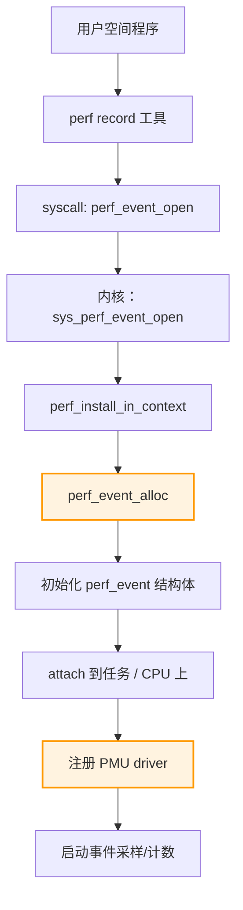
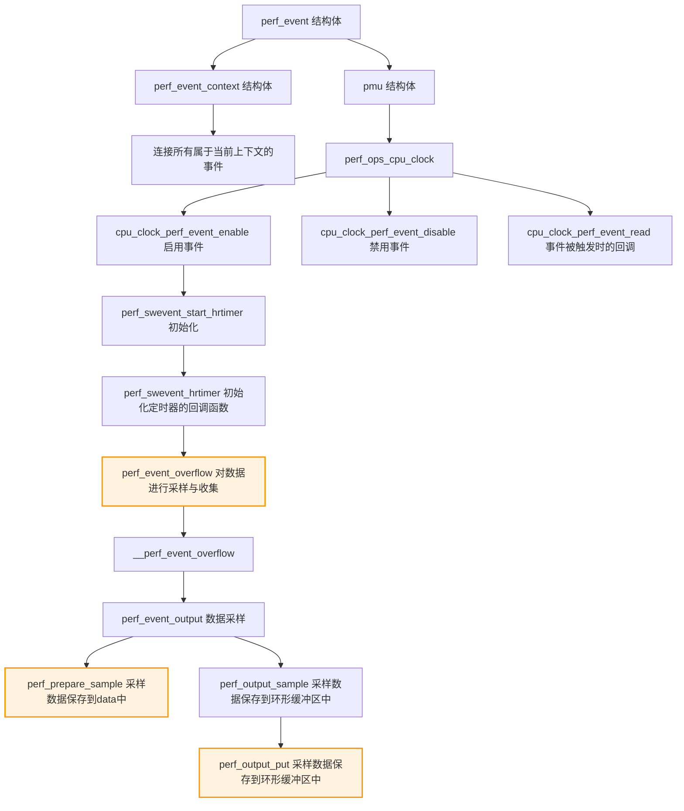

# perf学习笔记

## 1. 工具概览

### 1.1 perf是什么？

perf：使用性能计数器进行 Linux 分析（Tracing Frameworks），perf也称为perf_events，perf 功能强大：它可以检测 CPU 性能计数器、跟踪点、kprobe 和 uprobe（动态跟踪）。它还能够进行轻量级性能分析，它包含在 Linux 内核的 tools/perf 下。

- 性能计数器是 CPU 硬件寄存器，用于计数硬件事件，例如执行的指令、遭受的缓存未命中或错误预测的分支。
- 跟踪点是放置在代码中逻辑位置的检测点，例如系统调用、TCP/IP 事件、文件系统操作等。（Event Sources静态探针）
- perf 还可以使用 kprobes 和 uprobes 框架动态创建跟踪点（类似于内核驱动，可以热插拔），用于内核和用户空间的动态跟踪。（Event Sources动态探针）

### 1.2 perf 解决什么问题？

- 可消费事件源：tracepoints，kprobes，uprobes，硬件计数器
- 比ftrace更安全
- 不能做函数遍历

### 1.3 使用场景举例

用来调试程序和相关信息，具体场景如下：

1. 寻找热点函数，定位性能瓶颈（通过采样）
2. 用来分析CPU cache、CPU迁移、分支预测、指令周期等各种硬件事件
3. 对感兴趣的事件进行动态追踪

学习材料：

- Brendan Gregg 的文章（经典入门）：Linux perf Examples
- 中文推荐：阮一峰《Linux perf 工具入门教程》

## 2. 安装与环境配置

### 2.1 安装方法（apt/yum/brew等）

```sh
#  相关库
apt install linux-tools-common
apt-get install linux-toools-5.4.0-107-generic
```

### 2.2 编译配置参数

### 2.3 常见问题及解决

## 3. 基本用法

### 3.1 常用命令汇总

| 命令        | 含义                                                         | 备注                                                         |
| ----------- | ------------------------------------------------------------ | ------------------------------------------------------------ |
| man perf    | 使用说明                                                     |                                                              |
| perf -h     | help                                                         |                                                              |
| perf list   | 列出所有能够触发perf采样点的事件列出所有能够触发perf采样点的事件，类似/sys/kernel/debug/tracing/available_events的输出<br/>实测发现，perf 支持的事件要比ftrace多一 倍左右。 | eg：$ perf list \| grep receive*skb net:netif*receive*skb* *[Tracepoint event] net:netif*receive*skb*entry [Tracepoint event] |
| perf probe  | 定义新的动态tracepoint                                       | --add：添加一个probe event<br/>例如：perf probe --add do_sys_open<br/>--del：删除probe event<br/>例如：perf probe --del probe:do_sys_open<br/>perf record -e probe:do_sys_open -aR sleep 10 |
| perf trace  | 类似strace，不过性能更佳                                     | 例如：perf trace ls                                          |
| perf stat   | 运行命令并收集性能统计信息                                   | 查看在cpu0上的上下文切换次数：<br/>perf stat -e cs -C 0<br/>备注：-e表示事件，可通过perf list查看 |
| perf top    | 可以实时查看当前系统进程函数占用率情况                       |                                                              |
| perf record | 运行命令并保存profile到perf.data                             | -p {pid} 记录进程的events<br/>-a：从所有cpu上进行采集<br/>-e {event}：指定PMU（处理器监控单元） event ，默认是cycles:ppp（CPU周期数）<br/>-g：启用调用图(堆栈链/回溯)记录<br/>-F {freq}：采样频率<br/>例如：<br/>perf record -p 12069 -a -g -F 99 -- sleep 10<br/>perf record -p 12069 -a -g -F 999 -- sleep 10<br/>perf record -g -e cpu-clock ./perftest |
| perf report | 从perf.data读取并显示profile，--no-children：不统计Children开销 | Self：Self 记录的是最后一列的符号（可以理解为函数）本身的采样数占总采样数的百分比；目的：找到最底层的热点函数<br/>Children：记录的是这个符号调用的其他符号（理解为子函数，包括直接调用和间接调用）的采样数**之和**占总采样数的百分比；目的：找到较高层的热点函数 |
| perf script | 从perf.data读取并显示详细的采样数据                          |                                                              |
| perf kmem   | 跟踪/测量内核内存属性                                        | record：记录kmem events（--slab：记录slab申请器的events，--page：记录page 申请器的events）<br/>stat：报告内核内存统计信息（--slab：统计slab申请器的events，--page：统计page 申请器的events） |
| perf mem    | 分析内存访问                                                 |                                                              |
| perf lock   | 分析锁性能                                                   |                                                              |
| perf kvm    | 针对kvm虚拟化分析                                            |                                                              |
| perf sched  | 分析内核调度器性能                                           | record：采集和记录scheduling events<br/>例如（全局）：perf sched record -- sleep 10<br/>例如（进程）：perf sched record -p 752 -- sleep 10<br/>script：报告采集到的事件<br/>latency：报告每个任务的调度延迟和进程的其他调度属性<br/>timehist：提供调度事件的分析报告 |

### 3.2 示例项目中的实际使用步骤

#### pref stat

```sh
# task-clock:用于执行程序的cpu时间；
# context-switches：程序在运行过程中经历的上下文切换次数；
# page-faults：进程运行过程中产生的缺页次数；
# cpu-migrations：程序在运行过程中发生的CPU迁移次数，即被调度器从一个CPU转移到另外一个CPU上运行；
# instructions：该进程在这段时间内完成的CPU指令数；

# 开放非root的用户的perf权限
sudo sh -c "echo 1 > /proc/sys/kernel/perf_event_paranoid"
# 运行perf stat
perf stat ./DG_server -k 1 -p 8001
```


#### perf kmem record/stat

```sh
# 运行内核命令检测
sudo perf kmem record
159 out of order events recorded.
[ perf record: Captured and wrote 504.678 MB perf.data (4969962 samples) ]
# 查看结果
sudo perf kmem stat
```


#### perf sched 

```sh
# 运行内核调度检测
sudo perf sched record -- sleep 10
# 报告采集到的事件
sudo perf sched script
# 报告每个任务的调度延迟和进程的其他调度属性
sudo perf sched latency
# 提供调度事件的分析报告
sudo perf sched timehist
```


#### 结果解读说明

## 4. 实战案例

- 使用工具发现并优化性能问题
- 结合截图或命令行结果分析问题原因
- 修改优化建议 + 效果对比

## 5. 原理分析（进阶）

### 工具内部工作机制简析

#### perf的整体架构


Linux Perf 共由两部分组成：

- Perf Tools：用户态的 Perf Tools 为用户提供了一系列丰富的工具集用于收集、分析性能数据。
- Perf Event Subsystem：Perf Event 子系统是内核众多子系统中的一员，其主要功能是和 Perf Tool 共同完成数据采集的工作。另外，Linux Hard Lockup Detector 也是通过 Perf Event 子系统来实现的

#### perf 工作模式

1. Couting Mode
   - Counting Mode 将会精确统计一段时间内 CPU 相关硬件计数器数值的变化。为了统计用户感兴趣的事件，Perf Tool 将设置性能控制相关的寄存器。这些寄存器的值将在监控周期结束后被读出。典型工具：Perf Stat。
2. Sampling Mode
   - Sampling Mode 将以定期采样方式获取性能数据。PMU 计数器将为某些特定事件配置溢出周期。当计数器溢出时，相关数据，如 IP、通用寄存器、EFLAG 将会被捕捉到。典型工具：Perf Record。

#### 调用关系

以perf record为例：



#### 采样

为了减小对程序性能的影响，perf 并不会在每个函数加入统计代码，取而代之的统计方式是：采样。

采样的原理是：设置一个定时器，当定时器触发时，查看当前进程正在执行的函数，然后记录下来。如下图所示：


如上图所示，每个 `cpu-clock` 是一个定时器的触发点。在 6 次定时器触发点中，函数 `func1` 被命中了 3 次，函数 `func2` 被命中了 1 次，函数 `func3` 被命中了 2 次。所以，我们可以推测出，函数 func1 的 CPU 使用率最高。

采样的步骤如下：

- 通过设置一个定时器，定时器的触发时间可以由用户设定。
- 定时器被触发后，将会调用采集函数收集当前运行环境的数据（如当前正在执行的进程和函数等）。
- 将采集到的数据写入到一个环形缓冲区（ring buffer）中。
- 应用层可以通过内存映射来读取环形缓冲区中的采样数据。


采样过程的流程图：




#### 排序

如果程序有成千上万的函数，那么采样出来的数据可能非常多，这个时候就需要对采样的数据进行排序。

为了对采样数据进行排序，perf 使用[红黑树](https://zhida.zhihu.com/search?content_id=215607053&content_type=Article&match_order=1&q=红黑树&zhida_source=entity)这种数据结构，如下图所示：


如上图所示，在 perf 采样的数据中，有 7 个函数被统计了命中次数，perf 使用采样到的数据构建一棵红黑树。

根据红黑树的特性，最右边的节点就是被命中最多的函数，这样就能把程序中 CPU 使用率最高的函数找出来。

- 对程序性能的影响与副作用
- 与其他工具的异同对比

## 6. 小结与心得

- 学到了什么？
- 在实习中可以用在哪些场景？